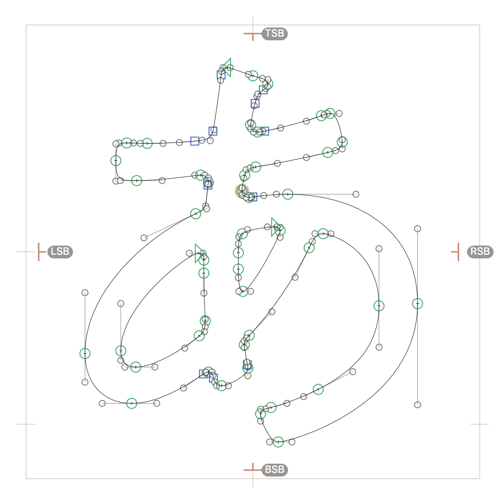

# CJKAnchorImport.glyphsPlugin

A Glyphs plugin to automatically place LSB/RSB/TSB/BSB anchors according to palt/vpal values when opening a font. Requires fontTools.

## Installation

1. Download the ZIP archive and unpack it, or clone the repository.
2. Double-click the `.glyphsPlugin` in the Finder. Confirm the dialog that appears in Glyphs.
3. Restart Glyphs.

## Notes

* Anchors are silently placed only when the palt/vpal tables are available.

## Requirements

Tested with Glyphs 2.3 on OS X 10.11.

## License

TBD
